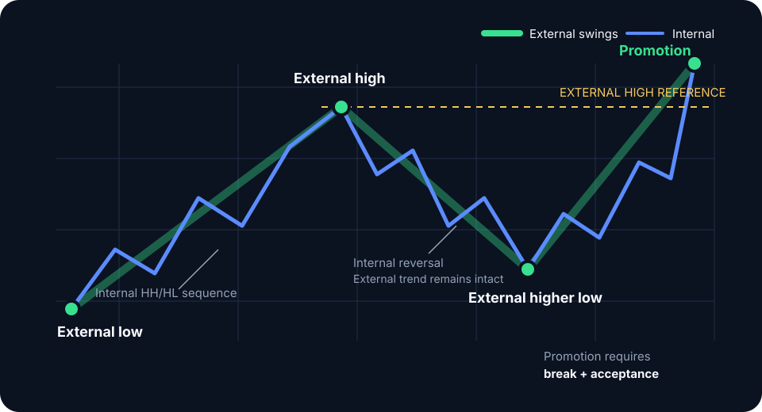

# External vs internal structure

**External structure** defines the swing boundaries that contain the current higher-order auction. **Internal structure** describes the smaller rotations inside those boundaries. Confusing the two turns ordinary pullbacks into false reversal signals.

## A top-down method

1. Select the decision timeframe used to hold the trade.
2. Mark the last confirmed external high and low that broke the opposing swing and established trade beyond it.
3. Drop one or two timeframes to map internal legs.
4. Use internal structure for timing only when it agrees with external location.

In a daily uptrend, a four-hour lower low can deliver price into daily value or a prior breakout. At the other extreme, a clean internal uptrend terminating at the external range high offers weak long asymmetry.

## Promotion and failure

Internal structure becomes externally relevant when it breaks an external boundary and the market accepts beyond it. Until then, it is nested rotation. A boundary breach that immediately returns inside is more accurately treated as a liquidity event or failed auction.

| Layer | Primary job | Typical use |
|---|---|---|
| External | Defines thesis and directional constraint | Bias, invalidation, major targets |
| Internal | Reveals path inside the thesis | Entry timing, tighter risk, management |


Fix the analysis, setup, and trigger timeframes before the session. Dropping below the trigger timeframe to manufacture confirmation invalidates the test.


**Study protocol:** Map four-hour structure inside 30 completed daily ranges. Record every internal reversal, its distance from the external boundary, and whether it promoted to external structure. Use the results to set a minimum structural significance rule.
