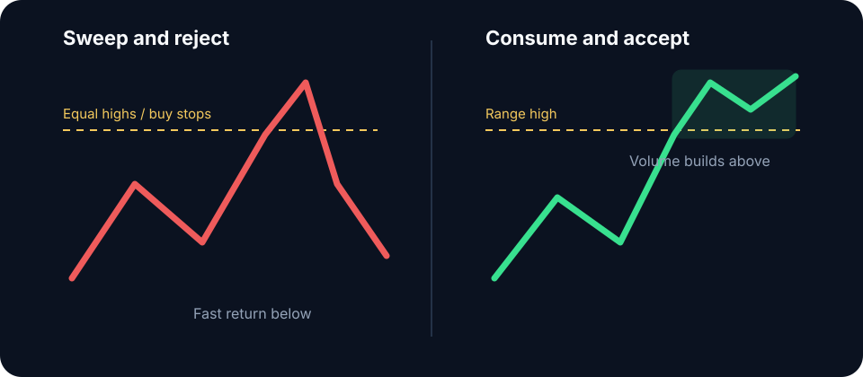

# Liquidity

Liquidity is the market's capacity to absorb transactions without excessive price impact. In chart analysis, the term also refers to areas with probable order concentration: prior highs and lows, equal extremes, range edges, liquidation clusters, and high-volume reference points.

## Why price seeks liquidity

Large executions require counterparties. Stops above highs become marketable buy orders; stops below lows become marketable sell orders. Breakout entries add flow at the same prices. The resulting transaction burst can clear the path for continuation or transfer inventory to a participant fading the break.

The level does not predict the outcome. Observe what happens after it trades:

- **Sweep and reject:** price crosses, cannot build trade, and returns through the level.
- **Consume and accept:** price crosses, holds, retests, and continues.
- **Repeated test:** declining response suggests resting liquidity is being consumed; stable response with repeated aggressive flow suggests replenishment. The next displacement resolves the distinction.

## Crypto considerations

Liquidation heatmaps estimate leveraged exposure; they are not a complete order book. Visible depth can be canceled, spoofed, or fragmented across exchanges. Use these tools to frame likely interaction zones, then validate with traded volume and price response.


Treat heatmap bands as scenario locations. They are model-dependent estimates that can become stale after rapid changes in open interest or leverage distribution.


**Study protocol:** Pre-mark prior-day high and low, equal extremes, and balance edges for 50 sessions. Record first-touch outcome, time spent beyond, delta, open-interest change, MAE, and MFE. Segment results by session and volatility regime.
