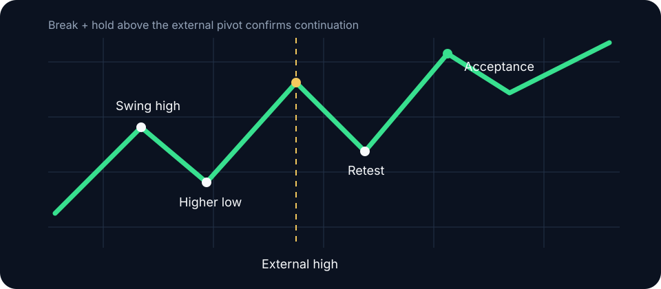

# Market structure

Structure is the sequence of auctions left by price. Higher highs and higher lows describe an uptrend; the actionable information is which swing caused displacement, which liquidity traded, and whether price established value beyond the broken pivot.

## Define swings consistently

Specify the pivot rule. A local swing high might require two lower highs on each side. A structural swing can require a close through the opposing pivot, range expansion above a defined volatility threshold, and acceptance beyond it. Fix the definition for the entire sample.

Distinguish:

- **Continuation break:** price closes beyond the external swing in the trend direction and establishes trade beyond it.
- **Sweep:** price trades beyond the swing but quickly returns.
- **Character change:** the first failure of the swing sequence that generated the active directional leg.
- **Reversal:** a character change followed by acceptance in the opposing direction. One broken internal pivot is insufficient.

## Read the quality

A high-quality structural break combines range expansion, limited overlap, volume above its local baseline, and value developing beyond the level. Wicks and repeated recrossing identify an unresolved test until the market establishes trade on one side.

Structure is timeframe-dependent. A one-hour down leg can be an internal pullback within a daily uptrend. State the timeframe whenever you name a trend.


A wick through a swing is an event. Acceptance beyond the swing is information.


**Study protocol:** Label confirmed swings on 50 unmarked charts using one written pivot rule. Add closes, volume, and profile data in stages. Measure classification changes and inter-rater consistency for continuation, sweep, and unresolved auction.
