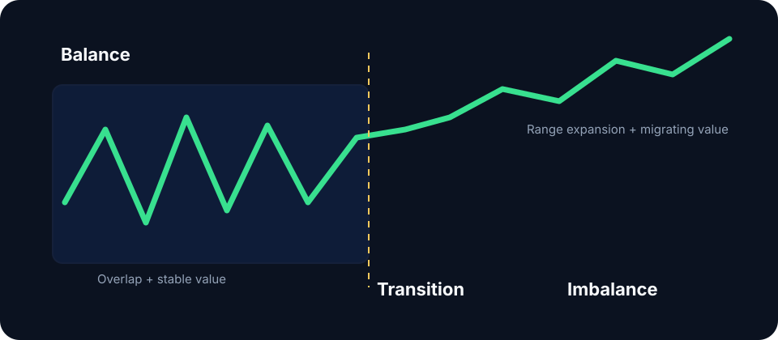

# Balance / imbalance

Markets alternate between **balance**, where buyers and sellers agree enough to trade around a fair area, and **imbalance**, where one side is urgent enough to move price in search of new counterparties.

## Recognizing the state

Balance tends to show overlapping candles, two-sided rotations, contained range, and a stable developing point of control. Imbalance shows directional range expansion, limited overlap, shallow counter-rotation, and migrating value.

The practical distinction changes the strategy:

| State | Default behavior | Favored logic |
|---|---|---|
| Balance | Rotate around value | Fade rejected extremes; target the opposite side |
| Imbalance | Discover new value | Trade pullbacks or accepted breakouts |
| Transition | Test whether the old state survives | Reduce size or wait for confirmation |

## Balance rules

The middle of balance offers poor asymmetry because targets and invalidation are both nearby. At an edge, defined invalidation improves trade construction. The edge becomes a reversal location only after rejection; acceptance outside converts it into a continuation reference.

Nested balances are common in crypto: an intraday range may exist inside a weekly directional auction. Name both the timeframe and boundary.


Match tactics to state. Trend entries inside balance suffer repeated mean reversion; range fades lose validity once value develops outside the boundary.


**Study protocol:** Classify 50 sessions at a fixed midpoint as balance, imbalance, or transition using explicit thresholds for overlap, range expansion, and POC migration. Compare each classification with the completed session and report confusion rates.
