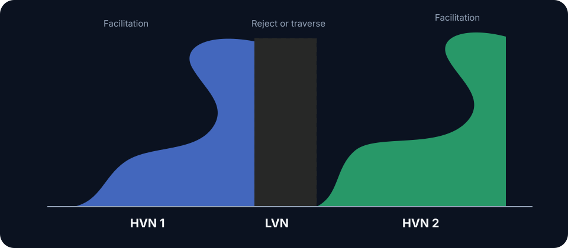

# HVN / LVN

A **high-volume node (HVN)** is a local concentration of traded volume within the selected profile. It records past facilitation and tends to slow trade when the same auction remains relevant. A **low-volume node (LVN)** is a local volume trough produced by rejection or efficient traversal.

## Expected behavior

At an HVN, prior facilitation supports two-sided execution and rotation. At an LVN, price either rejects or traverses toward the next distribution. Profile origin, direction of approach, and current flow determine which response is tradable.

Treat nodes as zones. Bin size, profile period, and feed quality alter their boundaries. Record those parameters; otherwise two charts labeled with the same node are not reproducible.

## Composite profiles

Profile a completed balance to locate its distribution. Multiple HVNs separated by an LVN form a double distribution: acceptance through the separator can rotate toward the other distribution's HVN; rejection can return price to the origin node.

## Decision sequence

1. Identify the profile that generated the node.
2. Determine whether price approaches from balance or imbalance.
3. Observe speed, volume, and response at the zone.
4. Require acceptance or rejection before choosing rotation or continuation.


An HVN does not inherently support price, and an LVN is not inherently resistance. Direction of approach and current participation decide the response.


**Study protocol:** Select 30 completed balances and lock the profile anchors before viewing future trade. Record the first revisit to each major node, approach velocity, time in zone, rotation distance, and traversal rate.
