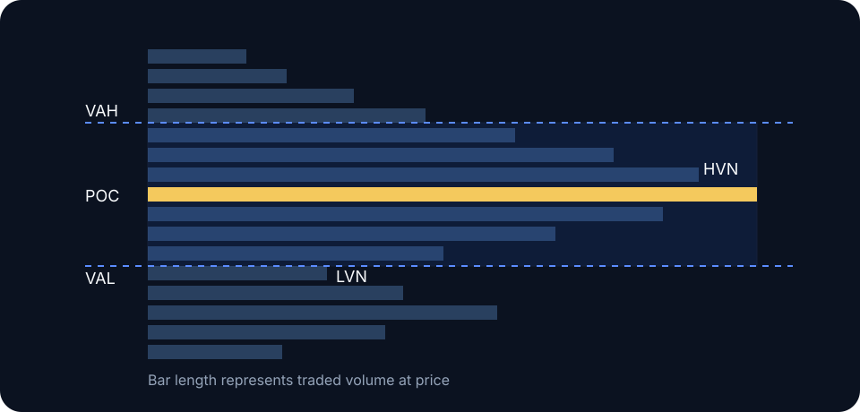

# Value

Value is the price region that concentrated two-sided trade during the selected auction. A conventional volume-profile value area contains about 70% of the profile's volume. The percentage is a calculation parameter and has no claim to intrinsic fair value.

## Reference selection

The profile period defines the question. Prior-day, current-session, composite-range, and event-anchored profiles describe different auctions. Select the period from the decision horizon and keep it fixed through review.

## Reading value migration

- **Higher value:** buyers are facilitating trade at progressively higher prices.
- **Lower value:** sellers are facilitating trade lower.
- **Overlapping value:** continued balance or weak directional conviction.
- **Price away from value:** active discovery; watch whether value follows or price returns.

Price above value indicates location outside the selected distribution, not overvaluation. Price below value does not establish a discount. During directional discovery, value can migrate behind price for several sessions.

## Open scenarios

An open inside prior value favors initial rotation. An open outside value but inside the prior range tests whether price returns to agreement. An open outside both value and range can continue if the new area is accepted; otherwise it may traverse back toward prior value.


Keep profile settings, timezone, and data source consistent. A UTC crypto session profile will differ from one split around another exchange's settlement.


**Study protocol:** Track 30 consecutive daily profiles with a fixed UTC session and feed. At a fixed time before close, estimate final VAH, VAL, and POC. Record migration, overlap percentage, and forecast error.
