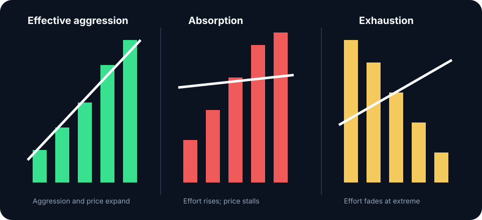

# Absorption

Absorption occurs when substantial aggressive flow trades into resting liquidity but price makes limited progress. At a high, repeated market buying may be filled by a large passive seller; at a low, aggressive selling may meet a passive buyer.

## Evidence stack

Look for several features together:

- High executed volume or extreme delta
- Repeated trading at the same extreme
- Minimal extension despite continued aggression
- Inability to close beyond the area
- Subsequent displacement away from it

The final response is essential. A large passive participant can absorb temporarily and then be consumed. Acting before price moves away assumes the defense will survive.

## Absorption versus hidden liquidity

Iceberg tools infer replenishing orders, but inference quality depends on venue mechanics and data. You do not need to identify a specific iceberg to trade the observable fact that effort is failing to produce result.

## Execution use

At a planned range extreme, absorption can support a rejection thesis. Enter on the reclaim or subsequent structural break, invalidate beyond the defended extreme, and target the next auction reference. In the middle of balance, the same pattern may be noise.


Large volume identifies activity. Classify absorption only when aggressive effort fails to produce proportional progress and price subsequently displaces away from the defended level.


**Study protocol:** Compare 50 confirmed absorptions with 50 passive defenses that were consumed. Measure test count, normalized delta, time at level, extension per unit volume, and confirmation delay.
