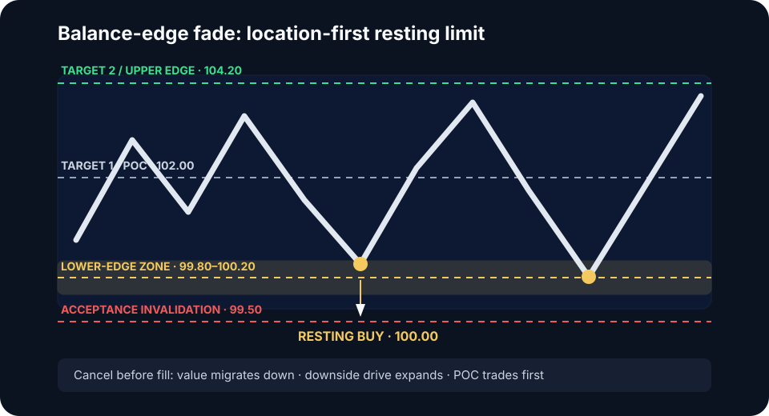

# Balance-edge fade

The balance-edge fade is the library's primary location-first model. It buys a
qualified lower edge or sells a qualified upper edge while the market continues
to facilitate two-sided trade inside a stable distribution.

## Definition

A valid balance has a bounded upper and lower edge, overlapping rotations, and
value that is stable rather than migrating. The model assumes an outside test
will attract responsive participation and rotate back toward POC.

This is not a generic support trade. The location must belong to the same
accepted auction that produced the balance.

## Long model contract

| Field | Rule |
|---|---|
| Regime | Stable balance with non-migrating value |
| Reference | Predefined lower balance edge or VAL zone `[Z_low, Z_high]` |
| Authorization | Balance remains valid as price approaches; no downside acceptance |
| Limit | One tested rule inside the zone: proximal edge, midpoint, distal edge, or fixed ladder |
| Invalidation | Acceptance below `Z_low`, not the first tick through it |
| Cancel before fill | Value migrates down, downside impulse expands, or price reaches POC without entry |
| Target 1 | POC or balance midpoint |
| Target 2 | VAH or upper balance edge |

### Numeric example

Suppose the qualified lower-edge zone is `99.80–100.20`, tick size is `0.10`,
and the tested rule is the zone midpoint. The buy limit is `100.00`. If the
structural invalidation is acceptance below `99.50`, the stop order belongs
beyond that acceptance threshold plus the venue-tested execution buffer, not at
the limit simply because price traded through it.

Position size is calculated from the final stop distance, including fees and
expected slippage. The example prices describe structure, not a recommended
buffer.

## Evidence checklist

- At least two prior rotations define the distribution.
- POC and value are stable over the qualification window.
- The approach is overlapping or losing efficiency, not an expanding drive.
- No higher-timeframe imbalance is forcing discovery through the edge.
- The distance to POC justifies the full structural stop.

## When a resting limit is allowed

A resting order is permitted only because the regime and location authorize
the trade before the touch. If the entry model requires rejection first, cancel
the resting order and use the [Failed Auction
Reversal](failed-auction-reversal.md) instead.


Do not leave a passive bid at the edge while value migrates down. A fill during
accelerating discovery is adverse selection, not proof that the level worked.


## Validation sample

Separate first tests from repeated tests. Record zone rule, queue depth, maximum
penetration, time outside, POC migration, fill state, MAE, MFE, and rotation
completion. Compare resting limits with confirmation-first entries rather than
mixing them in one sample.
