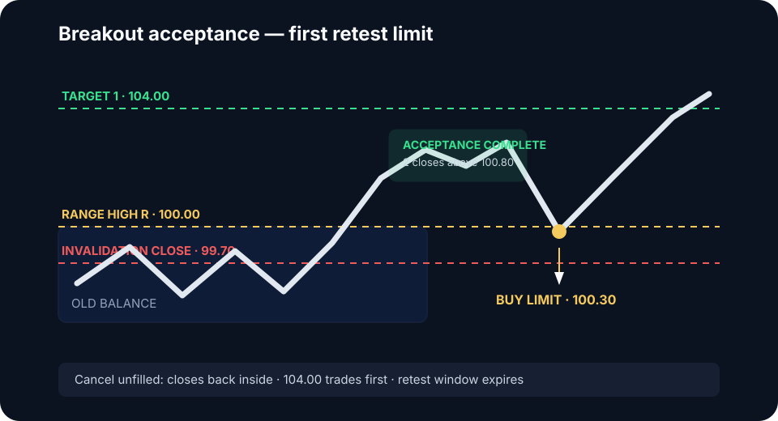

# Breakout Acceptance

The Breakout Acceptance setup enters after the market leaves balance and
establishes trade in the new area. Crossing the boundary identifies an attempt;
acceptance qualifies the trade. The default library variant is the first retest
of the accepted boundary because it defines both a reproducible limit and a
nearby structural failure point.

## Conditions

- A mature, clearly bounded balance
- A break with displacement and participation
- Time, closes, or volume building outside
- Value or developing POC beginning to migrate
- A retest that holds, or continued compression above the boundary

## Model contract

The long version leaves a balance through its upper boundary. Reverse every
price relationship for a downside break.

| Field | Rule |
|---|---|
| Regime | Mature balance transitioning to directional discovery |
| Reference | Exact balance high `R`, fixed before the break |
| Setup | Displacement through `R` followed by trade developing above it |
| Trigger | Tested acceptance rule: closes, time, volume, or value migration above `R` |
| Limit | Buy at `floor_to_tick(R + d)` on the first controlled retest |
| Invalidation | Sustained return into the old balance under the tested acceptance rule |
| Cancel before fill | Target 1 trades first, price accepts back inside, or retest window expires |
| Targets | External liquidity, next composite node, or tested projection |

The limit is never placed before acceptance. Doing so converts the trade into a
blind breakout order and exposes it to every sweep of the range high.

### Numeric long example

Assume the balance high `R` is `100.00`, tick size is `0.10`, acceptance is
defined as two execution-timeframe closes above `100.80`, and the tested retest
offset `d` is `0.30`. After acceptance completes, place a buy limit at `100.30`.
If the invalidation rule is a close below `99.70`, the protective stop is
derived from that condition plus the execution buffer—not from an arbitrary
fixed percentage.

If external liquidity at `104.00` trades before the retest, cancel the order.
The market has already delivered the modeled expansion.

## Entry variants

**Acceptance retest — default:** place the passive limit only after the
acceptance rule completes. This creates non-fill risk but preserves the model's
location and structural invalidation.

**Acceptance continuation:** after a consolidation outside, use a marketable
limit with an explicit worst price when it resolves in the breakout direction.
This is a separate momentum variant with different slippage and stop statistics.

**Initial break:** reserved for independently tested stop-entry or marketable
limit models. It is not part of the acceptance-retest sample and has the
greatest false-break and slippage exposure.

## Invalidation and targets

Invalidation is sustained return into the old balance under the same timeframe
used to define acceptance. A test of the edge remains valid while trade
continues to develop outside. A higher-timeframe opposing distribution directly
above the break reduces available payoff.


The cleanest accepted breakout changes the market's behavior: the former edge
stops acting as an extreme and begins acting as a base.


## No-trade conditions

Skip thin, isolated venue spikes; breaks without participation; price already
at Target 1; retests that accelerate through the boundary; entries far from
invalidation; or breakouts into an immediate higher-timeframe barrier.

**Validation sample:** Test one acceptance definition and one offset unchanged
across at least 100 breaks, with 30 reserved out of sample. Track retest
frequency, potential versus actual fills, queue depth, partial fills,
false-break rate, MAE, MFE, fees, slippage, and excursion before continuation.
