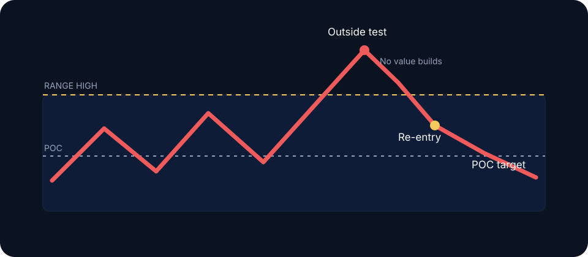

# Failed Auction Reversal

The Failed Auction Reversal trades re-entry into a prior auction after an outside test fails to establish value. Entry follows confirmed failure; the first excursion supplies location only.

## Conditions

- A clear prior range, value edge, session extreme, or composite boundary
- An excursion outside that attracts breakout flow or stops
- Little time or volume developing outside
- Re-entry and hold inside the boundary
- Enough room to the next reference for positive expectancy

## Execution model



## Frame the boundary

Mark the exact zone, expected liquidity, POC, and opposite edge before price arrives.



## Observe failure

Require rejection, ineffective aggression, or absorption followed by a reclaim.



## Trigger

Enter on the reclaim close, a failed retest from inside, or an internal structure break away from the extreme.



## Define risk

Invalidate beyond the failed extreme or where renewed outside acceptance disproves the thesis. Target POC first, then the opposite value edge when rotation persists.



## No-trade conditions

Skip when value is migrating through the boundary, correlated markets confirm discovery, event risk makes structure unreliable, or the first target cannot justify the stop.


The setup requires three separate observations: an attempted auction, failed outside acceptance, and flow consistent with continuation traders exiting. A touch of support or resistance satisfies none of them.


**Validation sample:** Collect at least 50 cases. Record boundary type, time and volume outside, entry model, initial risk, maximum favorable and adverse excursion, target reached, and rule adherence. Report results by regime instead of pooling all failures.
