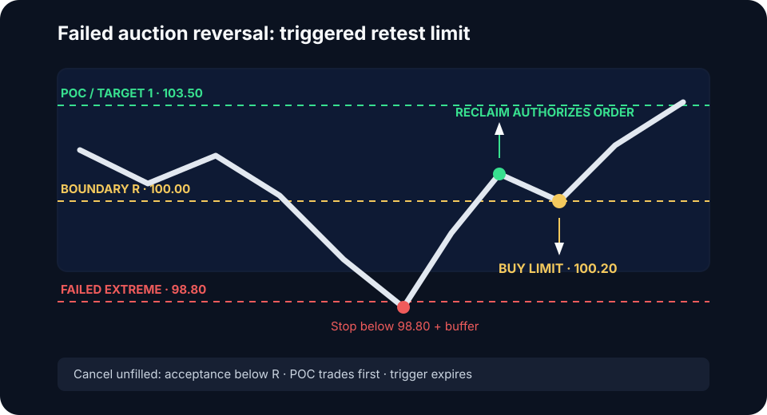

# Failed Auction Reversal


Freeze the boundary, failure and reclaim tests, retest window, offset, stop trigger source, cancellation, and targets in the [Frozen Model Specification](model-specification.md) before testing this variant.


The Failed Auction Reversal trades re-entry into a prior auction after an
outside test fails to establish value. Entry follows confirmed failure; the
first excursion supplies location only. It is a confirmation-first model, so a
resting limit outside the boundary is not permitted.

## Conditions

- A clear prior range, value edge, session extreme, or composite boundary
- An excursion outside that attracts breakout flow or stops
- Little time or volume developing outside
- Re-entry and hold inside the boundary
- Enough room to the next reference for positive expectancy after costs

## Model contract

The long version tests below a lower boundary and reclaims it. Reverse every
price relationship for a short above an upper boundary.

| Field | Rule |
|---|---|
| Regime | Balance or completed distribution; discovery has not gained acceptance |
| Reference | Exact prior boundary `R`, fixed before the excursion |
| Setup | Trade below `R` fails to build time or volume and returns inside |
| Trigger | Close and hold above `R`, or break of internal structure after re-entry |
| Limit | Triggered buy limit at `floor_to_tick(R + d)` on the first retest from inside |
| Invalidation | Renewed acceptance below `R` or the failed-auction extreme, as fixed by the tested variant |
| Cancel before fill | Price reaches POC, accepts below `R`, or exceeds the trigger-expiry rule |
| Targets | POC first; opposite value edge only if rotation remains accepted |

`d` is the tested offset inside the reclaimed auction. It may be zero. Define
it in ticks or as a fixed ATR fraction and keep that definition unchanged
through the sample.

### Numeric long example

Assume the lower boundary `R` is `100.00`, the outside extreme is `98.80`, tick
size is `0.10`, and the tested retest offset `d` is `0.20`. After price reclaims
and holds above `100.00`, place the buy limit at `100.20`. If the chosen
invalidation variant is the extreme, the structural stop belongs below `98.80`
plus an execution buffer. POC at `103.50` is the first target.

If price rotates to POC without retesting `100.20`, cancel the order. Do not
chase; the setup was valid but the limit did not fill.

## Execution sequence



## Frame the boundary

Mark `R`, expected liquidity, POC, opposite edge, tick size, entry offset, and
invalidation variant before price arrives.



## Observe failure

Require rejection, ineffective aggression, or absorption followed by re-entry.
Time below the edge must remain within the model's tested maximum.



## Authorize the order

Authorize only after the reclaim or internal structure break. Use a marketable
limit for the trigger-entry variant or a passive limit for the retest variant;
record them separately.



## Define risk and cancellation

Invalidate at the predefined failure point. Cancel any unfilled order if price
accepts outside again, reaches POC first, or the trigger expires.



## No-trade conditions

Skip when value is migrating through the boundary, correlated markets confirm
discovery, event risk makes structure unreliable, or POC cannot justify the
full structural stop and execution costs.


The setup requires three separate observations: an attempted auction, failed
outside acceptance, and re-entry. A touch of support or resistance satisfies
none of them. A buy limit below the boundary is a balance fade, not a failed
auction reversal.


**Validation sample:** Collect at least 50 cases. Record boundary type, time and
volume outside, reclaim rule, offset, trigger-to-order latency, queue depth,
fill state, initial risk, MAE, MFE, target reached, cancellation reason, and rule
adherence. Report results by regime and entry variant instead of pooling all
failures.
