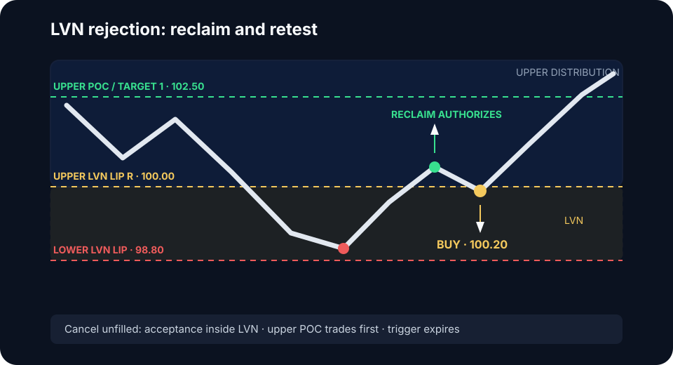

# LVN rejection / reclaim


Freeze the profile anchor, LVN zone, rejection and reclaim tests, retest window, offset, stop trigger source, cancellation, and targets in the [Frozen Model Specification](model-specification.md) before testing this variant.


An LVN is a low-volume corridor between accepted distributions. Price may move
quickly through it because little historical trade was facilitated there. This
model does not buy or sell the center of the LVN; it trades rejection after
price returns to the distribution from which the test began.

## Definition

For the long version, price approaches the LVN from the upper distribution,
tests into or through the low-volume corridor, fails to build acceptance below,
and reclaims the upper LVN lip. The entry seeks a retest of that reclaimed lip
for rotation through the upper distribution.

If price accepts inside the LVN, the rejection model is invalid. Fast travel
through the corridor is a different setup and must not be faded.

## Long model contract

| Field | Rule |
|---|---|
| Regime | Balance or pullback above a clearly defined LVN |
| Reference | Upper LVN lip `R`; LVN bounds fixed before the test |
| Setup | Excursion into the LVN with little acceptance, followed by reclaim of `R` |
| Trigger | Close and hold above `R`, or internal structure break above it |
| Limit | Triggered buy limit at `floor_to_tick(R + d)` on the first controlled retest |
| Invalidation | Renewed acceptance inside the LVN or break of the rejection extreme, whichever the tested model uses |
| Cancel before fill | Price reaches upper-distribution POC, retest becomes impulsive downward, or trigger expires |
| Targets | Upper-distribution POC, then VAH or external liquidity |

### Numeric example

If the LVN spans `98.80–100.00`, the upper lip `R` is `100.00`, tick size is
`0.10`, and tested offset `d` is `0.20`, the buy limit is `100.20` after, not
before, the reclaim. An invalidation at `98.60` risks the entire failed-rejection
structure. If that distance is too large for positive expectancy, skip rather
than moving the stop into the LVN arbitrarily.

## Qualification checklist

- The profile is built from a declared session or composite range.
- The LVN separates identifiable accepted distributions.
- The test shows rejection; volume and time do not accumulate in the corridor.
- The reclaim occurs on the same execution venue or is confirmed across the
  venues used for price discovery.
- The upper-distribution target provides sufficient payoff after costs.


Profile levels change when the sample window changes. Record the exact profile
range used to define the LVN; otherwise the model cannot be reproduced.


## No-trade conditions

Skip when value is migrating through the LVN, the profile has no distinct
distributions, the reclaim occurs only as an isolated wick, or the retest
returns with expanding downside range and aggression.

## Validation sample

Record profile window, LVN bounds, approach side, time and volume inside,
reclaim definition, limit offset, fill state, adverse selection after fill,
MAE, MFE, and target distribution reached. Test rejection and traversal as
separate populations.
