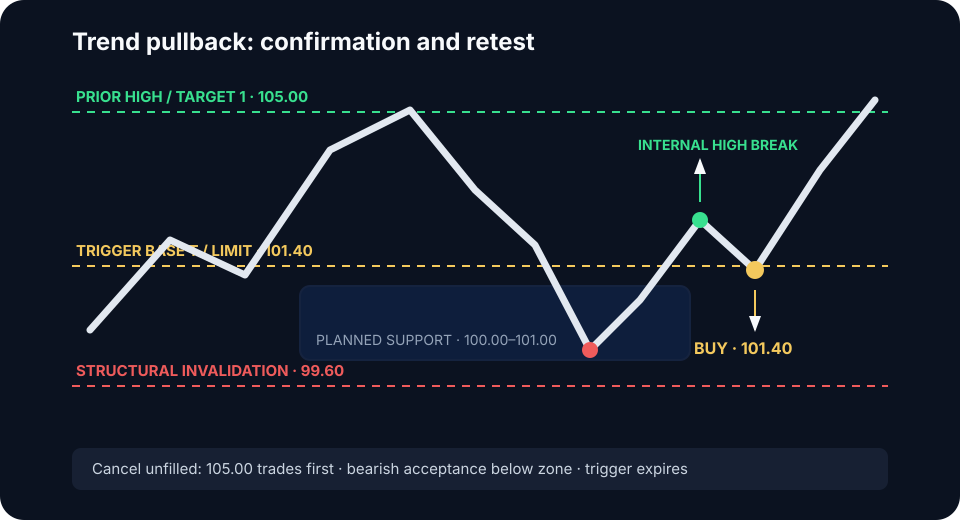

# Trend Pullback

The Trend Pullback joins an accepted directional auction after a countertrend
rotation reaches a predefined reference. The setup requires evidence that the
rotation is corrective and a structural point that invalidates continuation.

## Trend qualification

- External structure is intact and directional.
- Impulses displace; pullbacks overlap and travel less efficiently.
- Value and POC migrate with the trend.
- Breakouts are accepted rather than repeatedly rejected.
- The broader market and correlated leaders do not strongly conflict.

## Reference hierarchy

Candidate locations include prior breakout boundaries, developing value edges,
LVN lips, impulse origins, and internal liquidity sweeps. Rank them before the
pullback begins. Do not draw a new reference around the eventual turning point.

Use one of two variants:

- **Location-first:** the planned zone itself authorizes a resting limit after
  trend qualification. This requires independent evidence that blind tests of
  that reference have positive expectancy.
- **Confirmation-retest — default:** wait for rejection and an internal
  structure break, then place a limit at the first retest of the trigger base.

Do not pool the variants in testing.

## Model contract

| Field | Rule |
|---|---|
| Regime | Accepted directional auction with intact external structure |
| Reference | Preplanned support zone `[Z_low, Z_high]` in an uptrend |
| Setup | Corrective, overlapping return into the zone without bearish value migration |
| Trigger | Rejection plus break of the last internal lower high |
| Limit | Buy at the trigger base or `floor_to_tick(T + d)` on its first retest |
| Invalidation | Structural point proving the pullback is no longer corrective |
| Cancel before fill | Prior high trades first, bearish acceptance develops below the zone, or trigger expires |
| Targets | Prior trend high first; then external liquidity or profile objective |

`T` is the exact trigger-base reference, not the entire pullback zone. If using
a resting location-first limit, specify proximal edge, midpoint, distal edge,
or ladder and label the data separately.

### Numeric long example

Suppose the planned support zone is `100.00–101.00`. Price rejects it, breaks
the last internal lower high, and leaves a trigger base at `101.40`. With tick
size `0.10` and offset `d = 0`, the confirmation-retest buy limit is `101.40`.
The structural swing at `99.60` defines invalidation; the prior high at `105.00`
is Target 1.

If price trades `105.00` without retesting `101.40`, cancel the entry. If the
required stop makes Target 1 unattractive after costs, skip rather than moving
the stop inside structure.

## Confirmation-retest sequence

1. Price reaches the planned pullback zone.
2. Countertrend aggression loses effectiveness or is absorbed.
3. Price rejects the zone and breaks internal structure with the trend.
4. Mark the exact trigger base and place the passive limit for its first
   controlled retest.

Invalidate beyond the structural point that proves the pullback is no longer
corrective. Cancel an unfilled order if the prior extreme trades first or the
trigger ages beyond the tested window.


A deep pullback with expanding countertrend range, rising volume, and value
migrating against the trend signals transition. Remove the continuation premise
until trend acceptance returns.


## No-trade conditions

Skip late-stage parabolic moves, pullbacks directly after major regime-changing
news, conflicting external structure, expanding countertrend drives, entries
with no space before the prior extreme, or second and later retests unless
tested as a separate variant.

**Validation sample:** Separate at least 50 shallow and 50 deep pullbacks using
an ATR or retracement threshold fixed in advance. Record reference type, entry
variant, trigger-base rule, retest number, offset, fill state, queue depth,
structure, value migration, delta efficiency, continuation rate, MAE, MFE,
fees, and slippage.
